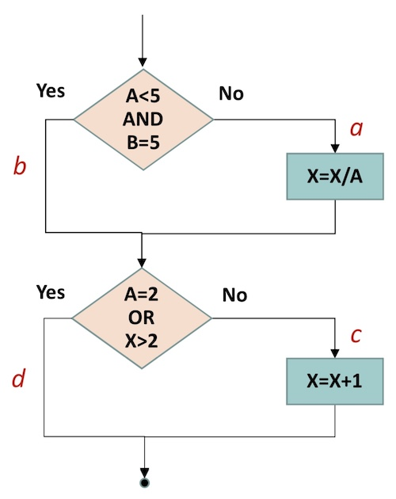

## 名词解释 6*5
- 软件缺陷
- 基线Baseline
- 软件质量度量
- ESTCA
- ODC
- SFMEA

## 简单题 4*10
- 杀虫剂悖论的理解
- 举例说明用判定表设计测试用例
- 举例Halstead的计算
- 举例软件故障植入的原理和实施过程

## 论述题 2*15
- 软件验证和确认的区别和联系
- 根据程序流程图
    

    (1) 画出相应的程序控制流图;

    (2) 计算 McCabe 环形复杂度;

    (3) 找出程序的一个独立路径集合;

    (4) 根据独立路径设计测试用例。